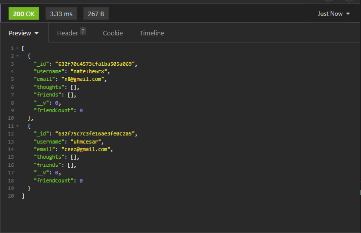

# Social-Network-API

The purpose of this assignment was to create a fully functioning database that stores user-name data as well of their thoughts in a fictatious social network website. The database allows for the user to get, create, update, and delete the data from their database whenever needed using GET, POST, PUT, and DELETE routes via Insomnia. The database allows for user-names to be created and stored alongside with their emails. Unique ids are generated to each individual user so you can search for a user specifically. Users are also able to be deleted by using their associated id. The database can also store user's thoughts, which essentially are comments are posts.

## Installation

Use `npm install`
Run on `node server.js`
Run on `insomnia`
